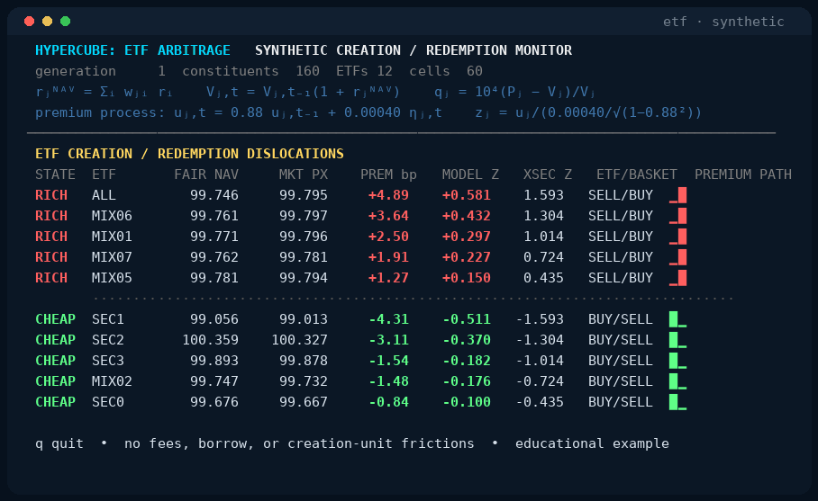
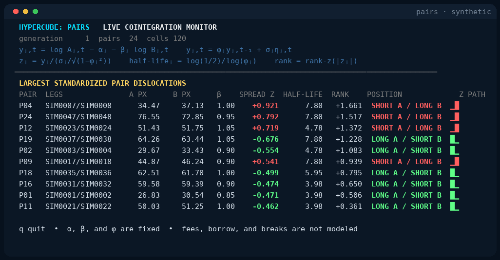

# Hypercube

Hypercube is an in-memory multidimensional analytics engine for low-latency
computation and linear algebra over changing data.

Hypercube is part of the open-source analytical architecture behind
strategynet.ai. Read the
[Hypercube architecture overview](https://strategynet.ai/insights/hypercube-open-source-live-analytics).

It has two separate layers:

- **Slice** is the physical live-state plane: typed, file-backed,
  memory-mapped vectors aligned to a stable entity layout.
- **Hypercube** is the logical execution plane: field, derived-node,
  generation, and entity dimensions evaluated as a deterministic dependency
  graph.

Rows can represent financial instruments, sensors, services, experiments, or
any other stable entity set. Hypercube does not include a database, message
transport, vendor feed, or effectful action system.

The publishable Cargo package is named `hypercube-engine`; its Rust library
name remains `hypercube`.

## See it live

### Hypercube: ETF Arbitrage

The `etf` monitor values synthetic ETFs from their constituent returns and
ranks the premiums and discounts to basket value:

```bash
cargo run -p hypercube-engine --example etf
```

[](docs/markup/README.md#hypercube-etf-arbitrage)

### Hypercube: Pairs

The `pairs` monitor generates cointegrated price paths, standardizes each
log-price residual against its AR(1) model, and ranks the live dislocations:

```bash
cargo run -p hypercube-engine --example pairs
```

[](docs/markup/README.md#hypercube-pairs)

The [recorded walkthrough](docs/markup/README.md) gives both calculations,
assumptions, and bounded commands. Press `q` to leave either monitor.

A browser example publishes a changing financial cross-section into
memory-mapped slices and streams it over HTTP:

```bash
cargo run -p hypercube-engine --example synthetic_server
```

Then open [http://127.0.0.1:8080](http://127.0.0.1:8080). The example:

1. generates a deterministic correlated cross-section every 250 ms;
2. removes the simulated market and sector moves from each stock return;
3. combines the residual rank with normalized log dollar volume;
4. publishes every output as an entity-aligned `.slice` file; and
5. streams the resulting cube to a dependency-free browser visualization.

Useful options:

```bash
cargo run -p hypercube-engine --example synthetic_server -- \
  --address 127.0.0.1:9090 \
  --entities 64 \
  --interval-ms 100 \
  --slice-dir /tmp/hypercube-demo
```

The demo exposes `GET /api/snapshot` and an SSE stream at `GET /api/stream`.
Its memory-mapped layout, catalog, and vectors are written beneath the selected
slice directory.

## Library API

```rust
use hypercube::{
    ExecutionMode, HypercubeEngine, InputRow, NodeSpec, Transform, Update,
    WeightedInput,
};

let rows = vec![
    InputRow::new("A", 1_000).with_field("price", 10.0),
    InputRow::new("B", 1_000).with_field("price", 12.0),
];
let nodes = vec![
    NodeSpec::field("price_rank", "price", Transform::RankZScore),
    NodeSpec::linear(
        "score",
        vec![WeightedInput::required("price_rank", 1.0)],
        true,
        Transform::Identity,
    ),
];
let snapshot = HypercubeEngine::new().update(Update {
    generation: 1,
    observed_at_ms: 1_000,
    mode: ExecutionMode::Live,
    rows,
    nodes,
})?;

assert!(snapshot.value("score", "B").unwrap() > 0.0);
# Ok::<(), hypercube::CubeError>(())
```

Node order is not execution order. Hypercube resolves dependencies
topologically, rejects missing required inputs and cycles, handles missing
entity values explicitly, and produces a deterministic snapshot for each
strictly increasing generation.

## Slice API

```rust
use hypercube::slice::{F64SliceReader, F64SliceWriter, LayoutRegistry};

let entities = vec!["A".to_owned(), "B".to_owned()];
let layout = LayoutRegistry::from_entities("example-v1", "example", 2, &entities)?;
let mut writer = F64SliceWriter::create("/tmp/example.slice", &layout, true)?;
writer.update_vector(|values| values.copy_from_slice(&[1.0, 2.0]))?;
writer.flush()?;

let reader = F64SliceReader::open("/tmp/example.slice")?;
assert_eq!(reader.snapshot_vec()?, vec![1.0, 2.0]);
# Ok::<(), anyhow::Error>(())
```

Slice also provides fixed-record quote, trade, and quote-at-trade payloads for
the first financial adapter, plus layout/catalog validation, guarded point
reads, stable vector snapshots, sums, dot products, and top-absolute scans.

## Repository layout

```text
crates/hypercube        `hypercube-engine` package, demo, and dashboard
crates/hypercube-slice  memory-mapped vector format and readers/writers
docs                    guides, terminal recording, papers, and format notes
```

The initial extraction intentionally excludes private service configuration,
data-vendor integrations, database writers, hard-coded factor registries, and
application-specific rollups. See the
[architecture](docs/architecture.md)
and
[slice format](docs/slice-format.md)
notes.

## Status

The current format is version 1, little-endian, and designed for one writer
with many readers. Multi-slice atomic generations, cross-language ABI fixtures,
replication, and general stateful function cells remain future work.

Continue with the
[guided tour](docs/guide.md),
the
[live-example walkthrough](docs/markup/README.md),
the
[architecture boundary](docs/architecture.md),
the
[slice format](docs/slice-format.md),
and the
[reproducible results](docs/results.md).
The [long-form foundations paper](docs/latex/README.md)
uses the current Slice and Hypercube API vocabulary.

Licensed under Apache-2.0.
