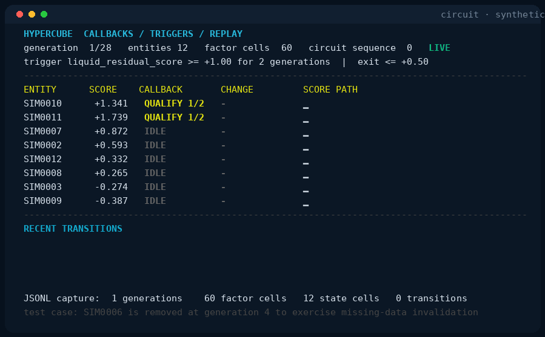

# Hypercube: live examples

All recordings are generated from checked-in programs. The inputs, terminal
frames, and GIFs are deterministic.

## Hypercube: callbacks, triggers, and replay



Run it:

```bash
cargo run -p hypercube-circuit --example circuit
```

Each live frame is one completed Hypercube generation. The callback watches
`liquid_residual_score`, requires two consecutive values at or above `1.0`,
and exits at or below `0.5`. The terminal shows qualifying counts, active
state, entry and exit events, and recent score paths.

At generation 4 the example removes active entity `SIM0006`. The callback
emits `INVALIDATED` rather than treating the missing input as a normal exit.
After 28 generations, the example seals its in-memory JSON Lines recording
and replays it through a fresh engine and fresh callback state. The final
frame compares factor cells, trigger-state cells, and transitions and reports
zero divergent generations.

## Hypercube: ETF Arbitrage


Run it:

```bash
cargo run -p hypercube-engine --example etf
```

The example creates 160 constituent stocks and 12 synthetic ETFs. Each ETF has
non-negative constituent weights that sum to one. For ETF \(j\), its
constant-weight basket return and fair value are:

```text
rNAV_j,t = Σ_i w_j,i r_i,t
V_j,t    = V_j,t-1 (1 + rNAV_j,t)
```

The simulated ETF can trade away from its basket value:

```text
P_j,t = V_j,t (1 + u_j,t)
q_j,t = 10,000 (P_j,t - V_j,t) / V_j,t = 10,000 u_j,t
```

Its fractional premium \(u\) follows a stationary AR(1) process:

```text
u_j,t = φ u_j,t-1 + σ η_j,t
φ = 0.88
σ = 0.00040
```

Because the stationary standard deviation is
\(\sigma_u=\sigma/\sqrt{1-\phi^2}\), the model z-score is:

```text
z_j,t = u_j,t / (σ / sqrt(1 - φ²))
```

Hypercube publishes aligned `fair_value`, `market_price`, `premium_bps`,
`premium_z`, and `cross_sectional_z` nodes for the ETF entities. `RICH` means
the ETF price is above basket value; `CHEAP` means it is below. The displayed
ETF/basket action is the convergence trade implied by that sign.

The calculation stops short of a complete ETF arbitrage model. Creation-unit
size, fees, borrow, dividends, tax, latency, inventory, and
authorized-participant constraints are omitted and named as omissions in the
terminal.

## Hypercube: Pairs


Run it:

```bash
cargo run -p hypercube-engine --example pairs
```

The example creates stable pair entities. Leg \(B\) carries a stochastic
trend; leg \(A\) shares that trend through hedge ratio \(\beta\). Their
cointegrating residual is:

```text
y_j,t = log A_j,t - α_j - β_j log B_j,t
```

The residual follows its own stationary AR(1) process:

```text
y_j,t = φ_j y_j,t-1 + σ_j η_j,t
```

The displayed z-score uses only the preceding 20 residuals, while the known
AR(1) coefficient still gives the model half-life:

```text
z_j,t         = (y_j,t - mean(y_j,t-20:t-1)) / sd(y_j,t-20:t-1)
half_life_j   = log(1/2) / log(φ_j)
```

The current residual is scored before it enters the fixed-capacity rolling
window, avoiding look-ahead in the displayed standardization. Until the prior
window has nonzero variance, the monitor emits a neutral zero.

Hypercube publishes the two current prices, `spread_z`, `half_life`, and a
cross-sectional `opportunity_rank = rank-z(|spread_z|)`. The table is sorted by
absolute z-score. A positive residual marks leg \(A\) rich relative to hedged
leg \(B\); a negative residual reverses the position.

The example holds \(\alpha\), \(\beta\), and \(\phi\) fixed so the calculation
remains visible. A production pairs process would estimate them on a declared
training window and add out-of-sample selection, stationarity tests,
structural-break rules, borrow, costs, and exposure limits. See the
[performance and stat-arb audit](../performance.md) for the reference
comparison and rolling-window benchmarks.

## Bounded runs

```bash
cargo run -q -p hypercube-engine --example etf -- \
  --entities 160 --funds 12 --top 5 --ticks 1 --no-color

cargo run -q -p hypercube-engine --example pairs -- \
  --pairs 24 --top 10 --ticks 1 --no-color
```

## Rebuild the recordings

Run this from the repository root:

```bash
python3 -m venv .venv
.venv/bin/python -m pip install Pillow
.venv/bin/python docs/markup/record.py
```

Pass a recording name to rebuild only one:

```bash
.venv/bin/python docs/markup/record.py circuit
```

The recorder invokes each program in `--record` mode and writes
[`circuit-replay.gif`](circuit-replay.gif), [`etf.gif`](etf.gif), and
[`pairs.gif`](pairs.gif). Seeds, dimensions, and frame counts are fixed so
changes produce reviewable recordings.
