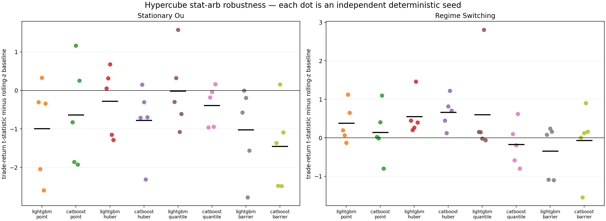

# Leakage-controlled stat-arb ML study

This experiment starts with a pairs strategy that has already identified a
causal mean-reversion trade, then measures whether tabular ML can make a better
accept-or-reject decision than the rolling z-score alone. In the homogeneous
stationary control, the simple policy remains best on average; when the
synthetic process moves through observable volatility regimes, persistence
shifts, and heavy-tailed shocks, robust point regression improves the baseline
across all five deterministic seeds. The result confirms that the harness can
detect useful conditional information when it is present in the data, while a
market-profitability claim would require the same protocol to succeed on real
prices and costs.

The Python research harness sits alongside the live Rust path, which continues
to run with its existing dependencies and rolling statistical signal.

## Result first

The table combines five independently generated studies, each evaluated over
two expanding historical windows. Its t-statistic describes normalized net
trade returns and provides a consistent comparison across policies; an
annualized Sharpe calculation or a formal significance test would also have to
account for capital allocation and dependence among pairs.

| Scenario | Policy | Mean trade t-stat | Delta vs rolling-z | Seed wins | Mean total-net delta |
| --- | --- | ---: | ---: | ---: | ---: |
| stationary OU | rolling-z | 12.666 | — | — | — |
| stationary OU | closest ML lane, LightGBM quantile | 12.648 | -0.018 | 2/5 | -91.283 |
| regime switching | rolling-z | 6.626 | — | — | — |
| regime switching | CatBoost Huber | **7.290** | **+0.664** | **5/5** | **+48.176** |
| regime switching | LightGBM Huber | 7.181 | +0.555 | 5/5 | +32.926 |

The useful conclusion concerns the loss function rather than a permanent
ranking of libraries: robust regression helps when observable conditions alter
the distribution of returns, while extra model capacity adds no incremental
value in the stationary control. Quantile and three-class models still provide
useful uncertainty and probability estimates, although the Huber models select
trades more effectively in this experiment.



The detailed reference-seed paths, fold metrics, calibration diagnostics, and
machine-readable manifests are in [`results/`](results/).

## How ML fits around the current pairs example

The Rust `pairs` monitor uses a declared AR(1) residual process and a
fixed-capacity rolling estimator, scoring each residual against the previous 20
observations before adding it to the window. The research harness keeps that
causal signal and its implied mean-reversion direction, then introduces ML at
the selection stage, where a model ranks or rejects candidates using the
information available at decision time. This separation lets the experiment
measure the value added by selection without allowing the model to redefine the
underlying trade.

## What “calibration” means here

The word *calibration* covers several operations in this study, each performed
at a different point in time and with a distinct purpose.

| Layer | Purpose | This study |
| --- | --- | --- |
| Residual calibration | Estimate hedge ratio, center, scale, and persistence. | The synthetic residual law is declared; every z-score uses only the preceding 20 observations. A real study must estimate hedge parameters inside each training fold. |
| Model fit | Learn return, quantile, or class score. | Expanding historical block. |
| Early stopping | Choose boosting iteration without fitting on later data. | A later validation block. |
| Predictive calibration | Correct point bias, quantile coverage, or class probability. | A still-later calibration block. |
| Policy calibration | Choose the minimum score at which a trade is accepted. | A separate selection block with a minimum trade count. |
| Evaluation | Measure the frozen pipeline. | An untouched test block. |

The observations are divided chronologically as follows:

```text
fit -> gap -> validation -> gap -> calibration -> gap -> selection -> gap -> test
```

Because a trade can remain open for 12 observations, we leave that much time
between one stage and the next, allowing every earlier outcome to become known
before later data influence the model. Within a pair, the experiment also waits
for an open position to finish before considering another candidate. Trades in
different pairs can overlap, so a formal portfolio significance test would need
to model their dependence explicitly.

During policy selection, the experiment tries score thresholds at the 0th,
20th, 40th, 60th, 75th, 85th, and 90th percentiles, requiring at least 30
accepted trades. It first chooses the threshold with the highest trade-return
t-statistic, then uses total net return and trade count to settle ties
deterministically. Model scores must remain nonnegative, and rolling-z retains
its original candidate threshold of 1.0. Declaring this small grid in advance
limits the opportunity to tune the policy to one historical period, although
some threshold-selection variance inevitably remains.

## Causal residual and candidate event

For pair \(j\), let the residual be

\[
e_{j,t}=\log A_{j,t}-\alpha_j-\beta_j\log B_{j,t}.
\]

With preceding window \(W_{j,t}=\{e_{j,t-20},\ldots,e_{j,t-1}\}\), the
candidate score is

\[
z_{j,t}=\frac{e_{j,t}-\mu(W_{j,t})}{\sigma(W_{j,t})}.
\]

The estimation window ends at \(t-1\), so the current residual contributes to
neither its center nor its scale. An event becomes a candidate when
\(|z_{j,t}|\ge 1\), and its fixed side is
\(s_{j,t}=-\operatorname{sign}(z_{j,t})\). Features contain the current
causal z-score, one/three/ten-step residual changes, a 5-to-20-step volatility
ratio, a trailing AR(1) estimate and half-life, and an observable market
volatility proxy. The latent synthetic regime and arbitrary pair identity are
not features.

## Triple barrier as a three-way target

Triple barrier turns each candidate into a three-class first-touch problem. For
future offset \(h\), define normalized gross trade return

\[
g_{j,t}(h)=s_{j,t}\frac{e_{j,t+h}-e_{j,t}}{\sigma(W_{j,t})}.
\]

With profit barrier \(b_+=0.75\), stop barrier \(b_-=1.00\), and vertical
horizon \(H=12\), define

\[
\tau_+=\inf\{h\in[1,H]:g(h)\ge b_+\},\qquad
\tau_-=\inf\{h\in[1,H]:g(h)\le-b_-\}.
\]

The first observed touch wins:

\[
y_{j,t}=\begin{cases}
+1,&\tau_+<\tau_-\text{ and }\tau_+\le H,\\
-1,&\tau_-<\tau_+\text{ and }\tau_-\le H,\\
0,&\text{neither barrier is touched before }H.
\end{cases}
\]

The regression target uses the same exit but retains magnitude:

\[
r_{j,t}=g_{j,t}(\min(\tau_+,\tau_-,H))-c,
\qquad c=0.08.
\]

The classifier estimates which exit occurs, whereas the regressor estimates the
economic return earned at that exit. Since the class label omits within-class
overshoot and the variable payoff at the end of the horizon, we convert the
calibrated class probabilities back into expected net return using
class-conditional payoffs measured during calibration.

## Models and their calibration

### Point regression

LightGBM L2 and CatBoost RMSE estimate a conditional mean-like return. We
measure their average forecast error during calibration and carry that single,
fixed intercept correction into the later periods:

\[
\delta=\operatorname{mean}(r-\hat r),\qquad
\hat r^{\mathrm{cal}}(x)=\hat r(x)+\delta.
\]

The Huber lanes replace squared loss with a quadratic center and linear tails.
They are the most directly useful choice here when bad regimes contain
heavy-tailed shocks: both Huber implementations beat rolling-z in all five
positive-control seeds.

### Quantile regression

LightGBM fits separate 20th, 50th, and 80th percentile models, while CatBoost
fits the same three outputs jointly with `MultiQuantile`. For each quantile
\(q\), we compare the forecast with the calibration-period outcomes and learn
the following marginal correction:

\[
\Delta_q=\operatorname{Quantile}_q(r-\widehat Q_q(x)),\qquad
\widetilde Q_q(x)=\widehat Q_q(x)+\Delta_q.
\]

Corrected outputs are sorted per row to prevent quantile crossing. The frozen
selection score is a pre-declared lower-tail utility,

\[
u_Q=\widetilde Q_{0.50}
 -0.25\bigl(\widetilde Q_{0.50}-\widetilde Q_{0.20}\bigr).
\]

A strict rule requiring \(\widetilde Q_{0.20}>0\) accepts almost no events with
this barrier geometry, because more than one fifth of the reference outcomes
reach the stop. The calibrated test coverages remain close to their targets:
roughly
0.18–0.20, 0.47–0.49, and 0.79–0.80 for the three quantiles.

### Three-class barrier classifier

LightGBM and CatBoost fit the stop, vertical, and profit outcomes with class
weights derived from the training data. Weighting improves attention to
infrequent outcomes but distorts the raw scores as probability estimates, so we
fit one-vs-rest sigmoid calibrators on the later calibration period. The
economic score is

\[
u_C(x)=\sum_{k\in\{-1,0,+1\}}
P^{\mathrm{cal}}(y=k\mid x)\,\bar r_k,
\]

where \(\bar r_k\) is the calibration-block mean net payoff for class \(k\).
On the untouched reference tests, expected calibration error for the profit
class is about 0.03. The probabilities therefore have a useful interpretation,
although the classifier still ranks profitable trades less effectively than the
best Huber model.

## LightGBM or CatBoost?

Both libraries provide L2, Huber, quantile, and multiclass objectives, making
LightGBM a straightforward fast baseline and CatBoost an equally credible
alternative with strong categorical handling. Their main difference for this
study lies in quantile training: LightGBM produces independently trainable
models, while CatBoost can estimate the three quantiles together with its
`MultiQuantile` loss, which the current official support table lists as
CPU-only.

We run CatBoost with `has_time=True` so that it preserves the supplied temporal
order instead of randomly permuting rows. Chronological evaluation and the
12-observation gaps remain essential because ordering within the learner cannot
prevent outcomes from leaking across data splits. CatBoost Huber produces the
strongest replicated result under the controlled stress scenario, which makes
it the leading candidate for the next experiment rather than a universal
winner over LightGBM.

Relevant upstream references are the
[LightGBM objective documentation](https://lightgbm.readthedocs.io/en/stable/Parameters.html),
[CatBoost regression losses](https://catboost.ai/docs/en/concepts/loss-functions-regression),
[CatBoost time-order parameter](https://catboost.ai/docs/en/references/training-parameters/common),
and scikit-learn's
[probability-calibration guide](https://scikit-learn.org/stable/modules/calibration.html).
The triple-barrier formulation follows Marcos López de Prado's *Advances in
Financial Machine Learning*; it is a label construction, not protection
against leakage by itself.

## Where probabilistic Torch and graph models fit

The protocol can also support Volt's DeepSets or GraphNN models whenever
relationships across sets, paths, or graph neighborhoods carry information
that a row-wise tree cannot represent. Rolling-z and the boosted-tree models
should remain controls, giving a neural policy a clear benchmark against which
to justify its additional data, serving, and checkpoint complexity.

In Torch, three logits followed by a softmax can represent the
stop/vertical/profit outcome, while ordered heads trained with pinball loss can
estimate conditional quantiles. A network can instead return a location and
positive scale for a Gaussian or Student-t likelihood, and ensembles or dropout
can add diagnostics for model uncertainty. Each approach still needs the later
calibration period before its outputs are interpreted as reliable probabilities
or used to select trades.

A neural checkpoint should include the feature schema, normalization state,
target and barrier definition, calibration mapping, selection threshold,
library versions, and a content digest. A practical production arrangement
would keep causal rolling features and event handling in Rust while Python and
Torch handle training. Profiling can then show whether inference latency is
large enough to justify a native implementation.

## Scenario design

The stationary control uses a homogeneous Gaussian mean-reverting residual law,
leaving the additional features with little incremental structure beyond the
z-score. The regime-switching control moves among three persistence and
volatility states; stressed periods contain unit-variance Student-t(4) shocks,
and the breakdown state becomes mildly explosive. Models observe a noisy,
causal volatility proxy while the true regime remains available only for
diagnostics, creating a setting in which a conditional filter has genuine
information it can use.

The positive-control transition matrix is

\[
P=\begin{bmatrix}
0.965&0.030&0.005\\
0.060&0.890&0.050\\
0.150&0.100&0.750
\end{bmatrix}.
\]

State zero uses each pair's base persistence and volatility. State one adds
0.10 to persistence (capped at 0.985), multiplies innovation scale by 1.8,
and uses standardized Student-t(4) idiosyncratic noise. State two sets
persistence to 1.025, multiplies scale by 2.5, and retains the same heavy-tailed
noise. A smoothed same-time common-volatility measurement is available to the
models; the state itself is not. The stationary control instead fixes
\(\phi=0.90\), \(\sigma=0.004\), and Gaussian noise for every pair.

All returns are normalized residual units. Costs, borrow constraints, market
impact, parameter-estimation error, asynchronous legs, portfolio capital, and
real market microstructure are not modeled. These are controlled algorithm
tests, not executable-arbitrage results.

## Reproduce it

Install the pinned research dependencies in an isolated environment, then run:

```bash
python3 -m unittest discover -s experiments/statarb_ml -p 'test_*.py' -v
python3 experiments/statarb_ml/run.py
python3 experiments/statarb_ml/robustness.py --count 5
```

`run.py` writes one detailed two-fold reference study. `robustness.py` derives
its additional seeds deterministically with NumPy `SeedSequence.spawn` and
writes the cross-seed comparison. Use `--quick` for a smoke-sized run.

Committed artifacts:

- [`summary.csv`](results/summary.csv) and
  [`fold_metrics.csv`](results/fold_metrics.csv): frozen reference-test trade
  outcomes;
- [`calibration_diagnostics.csv`](results/calibration_diagnostics.csv): point,
  quantile, and probability diagnostics;
- [`robustness_runs.csv`](results/robustness_runs.csv) and
  [`robustness_summary.csv`](results/robustness_summary.csv): five-seed evidence;
- [`manifest.json`](results/manifest.json) and
  [`robustness_manifest.json`](results/robustness_manifest.json): exact protocol,
  seeds, feature names, and package versions;
- [`statarb_ml_results.png`](results/statarb_ml_results.png),
  [`statarb_ml_calibration.png`](results/statarb_ml_calibration.png), and
  [`statarb_ml_robustness.png`](results/statarb_ml_robustness.png): paper-ready
  plots.

## Recommended next experiment

The synthetic study earns CatBoost Huber a place in the next comparison while
leaving the Rust z-score monitor as the operational baseline. That comparison
should freeze the same feature and label contract, estimate alpha and beta
inside each fold, and use survivorship-controlled market data with bid/ask
execution, borrow, and pair-level clustered or block-bootstrap uncertainty. A
model would become a production candidate after its improvement survives
changes in time, universe, costs, and calibration. The likely serving design is
a small, versioned model artifact behind the existing Rust candidate pipeline,
with rolling-z available as a fallback and explicit abstention whenever inputs
or calibration become stale.
